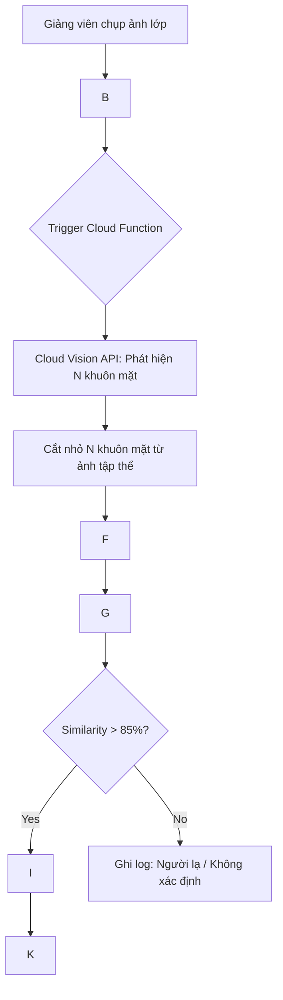

Dưới đây là chi tiết về **Technical Stack** (Ngân sách công nghệ) và **Architecture** (Kiến trúc hệ thống) được tối ưu hóa cho nền tảng Google Cloud (GCP) để triển khai ứng dụng điểm danh khuôn mặt tập thể.

---

## 1. Technical Stack (Ngân sách công nghệ)

Hệ thống được xây dựng trên mô hình **Cloud-Native** và **Serverless**, giúp loại bỏ việc quản lý hạ tầng vật lý và tự động mở rộng theo nhu cầu.

| Lớp (Layer) | Công nghệ / Dịch vụ GCP | Vai trò & Thông số kỹ thuật |
| :--- | :--- | :--- |
| **Frontend** | React Native / Flutter | Ứng dụng Mobile hỗ trợ chụp ảnh độ phân giải cao và Upload lên GCS. |
| **Lưu trữ ảnh** | **Cloud Storage (GCS)** | Lưu trữ ảnh chân dung (Registry) và ảnh tập thể (Attendance). Cấu hình Lifecycle để tự xóa ảnh sau 30 ngày để bảo mật. |
| **Tính toán** | **Cloud Run Functions** | Hàm Serverless thực thi logic xử lý ảnh. Sử dụng Python 3.11 để tận dụng các thư viện AI mạnh mẽ. [1, 2] |
| **AI Detection** | **Cloud Vision API** | Sử dụng tính năng `FACE_DETECTION` để phát hiện tọa độ khung bao của **tất cả** khuôn mặt trong ảnh tập thể. |
| **AI Embedding** | **Vertex AI Embeddings** | Model `multimodalembedding@001` chuyển đổi ảnh khuôn mặt thành Vector 768 chiều (Embedding). |
| **So khớp AI** | **Firestore Vector Search** | Tìm kiếm "hàng xóm gần nhất" (Nearest Neighbor) sử dụng thuật toán **Cosine Similarity** để xác định danh tính. |
| **Cơ sở dữ liệu** | **Cloud Firestore** | NoSQL Database lưu hồ sơ sinh viên và nhật ký điểm danh theo cấu trúc Document-Oriented. [3, 4] |
| **Bảo mật** | **IAM & Service Accounts** | Quản lý quyền truy cập đặc quyền tối thiểu (Least Privilege) giữa các dịch vụ. |

---

## 2. Luồng chạy hệ thống (Sequential Workflow)

Luồng chạy được thiết kế để tách biệt quá trình **Đăng ký** và **Điểm danh**, đảm bảo hiệu suất thời gian thực.

### Sơ đồ luồng (Mermaid Flowchart)

---

## 3. Kiến trúc chi tiết (Detailed Architecture)

Kiến trúc này sử dụng mô hình **Event-driven** (Hướng sự kiện), nơi Cloud Storage đóng vai trò là nguồn kích hoạt.

### Sơ đồ kiến trúc hạ tầng
--(HTTPS)-->
|
                                    (Event Trigger)
|
                                          v
                             

| (Orchestrator Logic) |
                              / | \
                    (API Call)       (API Call)      (Vector Query)

| | |
              [ Cloud Vision API ][ Vertex AI API ][ Cloud Firestore ]
              (Face Detection)     (Embeddings)      (NoSQL Data + Index)

### Các thành phần chính trong kiến trúc:

1.  **Hàm điều phối (Orchestrator - Cloud Run Functions):**
    *   Nhận thông tin tệp từ GCS.
    *   Gọi Vision API để lấy danh sách tọa độ khuôn mặt.[5]
    *   Thực hiện cắt ảnh (Crop) trực tiếp trong RAM (sử dụng thư viện `Pillow`) để tránh ghi file tạm, tăng tốc độ xử lý.
    *   Đẩy các ảnh cắt này qua Vertex AI để lấy Vector đặc trưng .

2.  **Kho lưu trữ Vector (Vector Store - Firestore):**
    *   Firestore không chỉ lưu metadata sinh viên mà còn trực tiếp thực hiện phép toán so sánh Vector.
    *   Sử dụng chỉ mục **Flat** hoặc **HNSW** (Hierarchical Navigable Small World) để tìm kiếm danh tính sinh viên nhanh chóng ngay cả khi cơ sở dữ liệu có hàng chục ngàn người.[6, 7]

3.  **Xử lý đám đông (Crowd Handling Logic):**
    *   Trong môi trường lớp học thực tế (như bộ dữ liệu **UCEC-Face**), ảnh thường có độ phân giải cao và sinh viên ngồi san sát .
    *   Kiến trúc này cho phép hàm Serverless cấu hình tham số `maxResults` của Vision API lên tới **100 khuôn mặt** trên mỗi lần gọi để đảm bảo không bỏ sót sinh viên .

4.  **Bảo mật & Quyền riêng tư (Privacy & Security):**
    *   Hệ thống tuân thủ nguyên tắc không lưu trữ ảnh gốc sau khi xử lý. Chỉ các Vector toán học (không thể dịch ngược thành ảnh mặt người) được lưu trong Firestore .
    *   Toàn bộ kết nối giữa các dịch vụ GCP được mã hóa thông qua mạng nội bộ của Google.

---

## 4. Ưu điểm của kiến trúc này
*   **Chi phí tối ưu:** Bạn không trả tiền cho CPU khi không có buổi học. Toàn bộ chi phí dựa trên số lượng ảnh upload (Pay-as-you-go).[2, 8, 9]
*   **Độ chính xác cao:** Kết hợp sức mạnh của Cloud Vision (phát hiện cực tốt các góc nghiêng) và Vertex AI (trích xuất đặc trưng sinh học tiên tiến) .
*   **Triển khai nhanh:** Toàn bộ thành phần đều là Managed Services, cho phép bạn tập trung 100% vào logic nghiệp vụ và giao diện người dùng.
*   

kaggle.com
Face-Based Attendance Dataset - Kaggle
Mở trong cửa sổ mới

ieeexplore.ieee.org
Chinese Face Dataset for Face Recognition in an ... - IEEE Xplore
Mở trong cửa sổ mới

github.com
Nexdata-AI/208-Vietnamese-2D-Living-Face-Anti-Spoofing-Data - GitHub
Mở trong cửa sổ mới

docs.cloud.google.com
Detect faces | Cloud Vision API - Google Cloud Documentation
Mở trong cửa sổ mới

codelabs.developers.google.com
Similarity Search with Spanner and Vertex AI | Google Codelabs
Mở trong cửa sổ mới

docs.cloud.google.com
Vector Search | Vertex AI | Google Cloud Documentation
Mở trong cửa sổ mới

mintlify.com
Vector Search - Generative AI on Google Cloud - Mintlify
Mở trong cửa sổ mới

github.com
duyet/vietnamese-namedb: Từ điển Họ Tên trong Việt Nam - GitHub
Mở trong cửa sổ mới

ijrar.org
Facial Recognition-Based Attendance Tracking System ... - IJRAR
Mở trong cửa sổ mới

irjet.net
SMART CAMPUS: SMART ATTENDANCE MANAGEMENT SYSTEM USING FACE RECOGNITION - IRJET

Dưới đây là bản báo cáo nghiên cứu chi tiết và toàn diện cho dự án **Hệ thống Điểm danh Sinh viên Tự động sử dụng Nhận diện Khuôn mặt (Cloud AI & Serverless)**. Tài liệu này tổng hợp các kết quả nghiên cứu về dữ liệu, kiến trúc hạ tầng và các giải pháp kỹ thuật tối ưu trên cả hai nền tảng đám mây hàng đầu.

---

# Báo cáo Nghiên cứu: Hệ thống Điểm danh Khuôn mặt Tập thể (Serverless & Cloud AI)

## 1. Tổng quan dự án
Mục tiêu là xây dựng một ứng dụng điểm danh không chạm, có khả năng nhận diện đồng thời nhiều sinh viên từ một bức ảnh chụp tập thể lớp học. Hệ thống tận dụng các mô hình AI đã được huấn luyện sẵn của các nhà cung cấp đám mây lớn để tối ưu hóa độ chính xác và giảm thiểu chi phí phát triển mô hình riêng.

## 2. Phân tích Dữ liệu và Dataset Thử nghiệm
Nghiên cứu chỉ ra rằng thách thức lớn nhất của hệ thống nằm ở môi trường lớp học "không kiểm soát" (uncontrolled environment), nơi ánh sáng không đều, góc nghiêng khuôn mặt đa dạng và mật độ người cao.[1, 2]

### 2.1. Các bộ dữ liệu lớp học chuyên biệt
*   **Face-Based Attendance Dataset (Kaggle):** Bộ dữ liệu mô phỏng môi trường học thuật, chứa ảnh sinh viên được gán nhãn theo định dạng YOLO để phát hiện và nhận diện trong lớp học .
*   **UCEC-Face (Uncontrolled Classroom Environment Chinese Face):** Gồm 7.395 hình ảnh của 130 đối tượng trích xuất từ 35 video giám sát lớp học thực tế.[2, 3] Đây là nguồn dữ liệu cực kỳ quan trọng để kiểm tra tính bền vững của AI trước các biến số như tư thế không chính diện (chiếm 52-70%) và vật cản (kính, tóc) .
*   **ClassRoom-Crowd:** Tập trung vào bài toán đếm đám đông và nhận diện trong các lớp học có mật độ sinh viên dày đặc với hơn 170.000 đối tượng được gán nhãn.[4]

### 2.2. Dữ liệu đặc thù người Việt và Bảo mật
*   **Vietnamese Face Dataset (Roboflow/GitHub):** Các bộ dữ liệu như *Vietnamese Celebrity Face Recognition* giúp cải thiện độ chính xác cho nhân chủng học địa phương, tránh hiện tượng thiên kiến (bias) của các model phương Tây.[5, 6]
*   **208-Vietnamese-2D-Living-Face-Anti-Spoofing:** Cung cấp dữ liệu để phát triển tính năng chống giả mạo, ngăn chặn sinh viên sử dụng ảnh chụp tĩnh hoặc video để điểm danh hộ.[7, 8]

## 3. Kiến trúc Hệ thống Serverless
Kiến trúc Serverless được lựa chọn nhờ khả năng tự động mở rộng (auto-scaling) và mô hình chi phí "dùng bao nhiêu trả bấy nhiêu" (pay-as-you-go) .

### 3.1. Giải pháp Google Cloud Platform (GCP)
GCP cung cấp sự linh hoạt cao trong việc tách biệt quá trình phát hiện và so khớp vector .
*   **Lưu trữ:** Google Cloud Storage (GCS) nhận ảnh upload và kích hoạt sự kiện .
*   **Xử lý trung tâm:** Cloud Functions hoặc Cloud Run điều phối luồng logic .
*   **AI Vision:** Cloud Vision API (`FACE_DETECTION`) để xác định tọa độ tất cả khuôn mặt trong ảnh tập thể .
*   **Vector Search:** Sử dụng Vertex AI Multimodal Embeddings để biến ảnh khuôn mặt thành vector đặc trưng  và thực hiện tìm kiếm "hàng xóm gần nhất" (Nearest Neighbor) ngay trên **Firestore Vector Search** .

### 3.2. Giải pháp Amazon Web Services (AWS)
AWS mang lại sự tích hợp chặt chẽ thông qua dịch vụ Rekognition chuyên biệt .
*   **Lưu trữ:** Amazon S3 bucket .
*   **Xử lý trung tâm:** AWS Lambda .
*   **AI Vision:** Amazon Rekognition cung cấp các API `IndexFaces` (để lập chỉ mục) và `SearchFacesByImage` (để đối sánh đồng thời nhiều mặt) .
*   **Định danh:** Rekognition Collections lưu trữ các Face Vectors thay vì ảnh gốc để bảo vệ quyền riêng tư .

## 4. Thiết kế Cơ sở dữ liệu NoSQL
Dữ liệu cần được tổ chức để phục vụ truy vấn thời gian thực và quản lý metadata sinh viên hiệu quả.

### 4.1. Cấu trúc Firestore (GCP)
*   **Collection `students`:** Lưu hồ sơ sinh viên và vector mẫu .
*   **Collection `attendance_logs`:** Lưu lịch sử với các trường `student_id`, `timestamp`, `session_id`, và `confidence_score` .
*   **Vector Indexing:** Thiết lập chỉ mục vector trên trường dữ liệu embedding để tối ưu tốc độ tìm kiếm KNN .

### 4.2. Thiết kế Single-table trên DynamoDB (AWS)
*   **Partition Key (PK):** Sử dụng tiền tố để phân loại (ví dụ: `STUDENT#SV001` hoặc `CLASS#C01`) .
*   **Sort Key (SK):** Dùng để sắp xếp dữ liệu theo thời gian (ví dụ: `ATTENDANCE#2024-05-20`) .
*   **GSI (Global Secondary Index):** Tạo chỉ mục trên `RekognitionId` để truy xuất nhanh thông tin sinh viên từ ID do AI trả về .

## 5. Quy trình Xử lý Chi tiết (Workflow)

1.  **Giai đoạn Đăng ký (Lập chỉ mục):**
    *   Tải ảnh chân dung sinh viên lên Cloud Storage/S3 .
    *   Hàm Serverless gọi API để trích xuất đặc trưng sinh học thành Face Vector (Embedding) .
    *   Lưu Vector vào NoSQL kèm theo thông tin định danh sinh viên.[9, 10]

2.  **Giai đoạn Thực thi (Điểm danh):**
    *   Chụp ảnh cả lớp, tải lên thư mục điểm danh của ngày hiện tại .
    *   Hàm Serverless tự động kích hoạt, gọi AI để phát hiện **tất cả** khuôn mặt có trong ảnh .
    *   Với mỗi khuôn mặt, AI thực hiện so khớp vector với kho dữ liệu mẫu .
    *   Nếu độ tương đồng (similarity) vượt ngưỡng (threshold) - thường là >85%, hệ thống xác định danh tính sinh viên .
    *   Ghi bản ghi điểm danh vào NoSQL. Sử dụng cơ chế *Conditional Writes* để ngăn chặn việc ghi trùng lặp trong cùng một buổi học.[11, 12]

## 6. Giải pháp cho các Thách thức Kỹ thuật

*   **Xử lý đám đông:** Nếu ảnh tập thể quá đông, Cloud Vision API/Rekognition có giới hạn về số lượng mặt phát hiện mỗi lần (thường từ 15-100) . Giải pháp là chia nhỏ bức ảnh gốc thành các vùng chồng lấp (tiling) trước khi gửi yêu cầu AI.[13, 14]
*   **Chống giả mạo (Spoofing):** Tích hợp tính năng "Face Liveness" để yêu cầu sinh viên thực hiện hành động nhỏ hoặc phân tích mẫu phản xạ ánh sáng, đảm bảo đó là người thật.[7, 15, 8]
*   **Độ trễ và Cold Start:** Sử dụng Cloud Run với thiết lập `min-instances` hoặc cấu hình bộ nhớ Lambda cao hơn để giảm thời gian phản hồi khi bắt đầu tiết học .
*   **Bảo mật dữ liệu:** Áp dụng IAM Roles chặt chẽ để chỉ hàm Serverless mới có quyền truy cập vào kho dữ liệu Vector . Toàn bộ dữ liệu nhạy cảm được mã hóa ở trạng thái nghỉ (encryption at rest) .

## 7. Kết luận
Hệ thống điểm danh khuôn mặt dựa trên Cloud AI và Serverless là một giải pháp tối ưu cho giáo dục thông minh. Việc tận dụng hạ tầng sẵn có của Google Cloud hoặc AWS giúp giảm bớt gánh nặng về quản trị máy chủ và huấn luyện mô hình, cho phép các tổ chức tập trung vào trải nghiệm người dùng và tính chính xác của dữ liệu.

---
*Tài liệu nghiên cứu được cập nhật theo tiêu chuẩn công nghệ đám mây năm 2025/2026.*
Dựa trên kiến trúc Google Cloud Platform (GCP), đây là luồng xử lý chi tiết (workflow) cho ứng dụng điểm danh khuôn mặt tập thể của bạn. Luồng này được thiết kế để tối ưu hóa việc sử dụng các dịch vụ **Serverless** và **Cloud AI** mà không cần bạn phải tự huấn luyện mô hình.

### 1. Giai đoạn chuẩn bị: Lập chỉ mục sinh viên (Indexing)
Trước khi hệ thống có thể nhận diện, bạn cần tạo "bộ nhớ" về khuôn mặt cho từng sinh viên.

1.  **Tải ảnh chân dung:** Sinh viên/Admin tải ảnh cá nhân rõ mặt lên **Google Cloud Storage** (GCS).
2.  **Kích hoạt Cloud Function:** Hành động tải ảnh kích hoạt một hàm **Cloud Run Function** (Serverless).
3.  **Trích xuất Vector (Embeddings):** Hàm này gửi ảnh đến **Vertex AI Multimodal Embeddings**. Hệ thống sẽ chuyển đổi khuôn mặt thành một chuỗi số (vector 128 hoặc 512 chiều) đại diện cho đặc trưng sinh học của người đó.
4.  **Lưu trữ vào Firestore:** Hàm lưu mã sinh viên (MSSV) kèm theo vector này vào **Cloud Firestore** dưới dạng trường dữ liệu `vector`.

---

### 2. Giai đoạn thực thi: Điểm danh từ ảnh tập thể
Đây là luồng chạy chính khi giảng viên chụp ảnh lớp học.

**Bước 1: Tải ảnh tập thể**
*   Giảng viên tải ảnh chụp toàn cảnh lớp học lên một thư mục cụ thể trên **Cloud Storage**.

**Bước 2: Phát hiện đa khuôn mặt (Face Detection)**
*   Hàm **Cloud Run Function** được kích hoạt và gửi bức ảnh tập thể đến **Cloud Vision API** với tính năng `FACE_DETECTION`.[1]
*   **Kết quả trả về:** Tọa độ khung bao (Bounding Boxes) của **tất cả** các khuôn mặt có trong ảnh tập thể.[1, 2]

**Bước 3: Cắt và tạo Embedding cho từng khuôn mặt**
*   Với mỗi tọa độ khuôn mặt nhận được, hàm Serverless sẽ cắt (crop) vùng ảnh đó.
*   Hàm gửi từng khuôn mặt nhỏ này đến **Vertex AI** để lấy vector đặc trưng tương ứng.

**Bước 4: So khớp Vector (Vector Similarity Search)**
*   Hệ thống thực hiện truy vấn **Nearest Neighbor** (Tìm hàng xóm gần nhất) ngay trong **Firestore** hoặc **Vertex AI Vector Search**.
*   Nó sẽ so sánh vector từ ảnh tập thể với kho vector sinh viên đã lưu ở Giai đoạn 1.
*   **Khoảng cách Cosine hoặc Euclidean:** Nếu khoảng cách giữa hai vector nhỏ hơn một ngưỡng (threshold) cho trước (ví dụ: độ tin cậy > 85%), hệ thống xác định đó là cùng một người.

**Bước 5: Ghi nhận kết quả vào NoSQL**
*   Hàm lấy mã sinh viên (MSSV) tương ứng và tạo một bản ghi điểm danh trong Collection `attendance_logs` trên **Firestore**.
*   Các thông tin ghi lại gồm: `student_id`, `timestamp`, `class_id` và `confidence_score`.[3]

---

### Tóm tắt các thành phần GCP sử dụng:

| Thành phần | Dịch vụ GCP | Vai trò |
| :--- | :--- | :--- |
| **Lưu trữ ảnh** | Cloud Storage | Nơi nhận ảnh tập thể từ Mobile/Web App. |
| **Xử lý trung tâm** | Cloud Run Functions | Chạy code logic xử lý ảnh và gọi API. |
| **Phát hiện vị trí mặt** | Cloud Vision API | Tìm xem có bao nhiêu người và họ nằm ở đâu trong ảnh. |
| **Trích xuất đặc trưng** | Vertex AI Embeddings | Biến hình ảnh khuôn mặt thành dữ liệu số (vector). |
| **So khớp danh tính** | Vertex AI Vector Search | Tìm sinh viên có khuôn mặt giống nhất trong cơ sở dữ liệu. |
| **Cơ sở dữ liệu NoSQL** | Cloud Firestore | Lưu hồ sơ sinh viên và nhật ký điểm danh. |

### Ưu điểm của luồng này:
*   **Xử lý đám đông:** Cloud Vision API có khả năng phát hiện hàng chục khuôn mặt trong một ảnh tập thể duy nhất.[4]
*   **Tốc độ:** Việc tìm kiếm vector trên Firestore/Vertex AI diễn ra cực nhanh (vài mili giây) ngay cả với hàng ngàn sinh viên.
*   **Tiết kiệm:** Bạn chỉ trả tiền khi có ảnh tải lên (Pay-as-you-go), không cần duy trì máy chủ chạy 24/7.